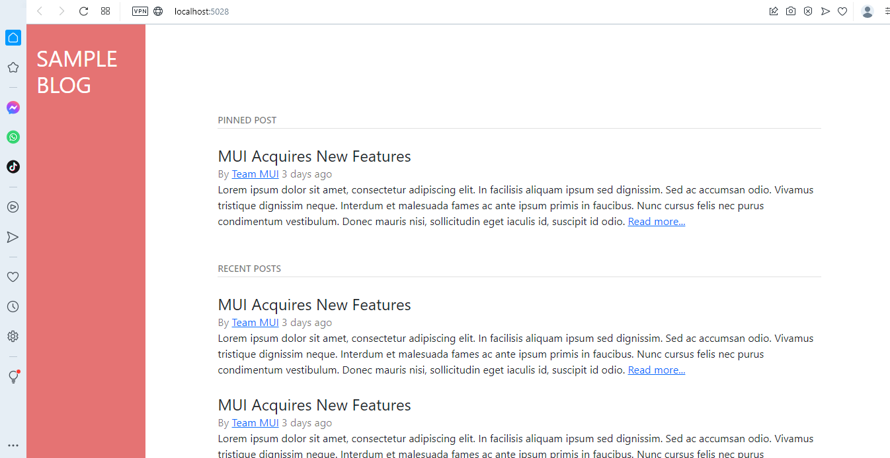
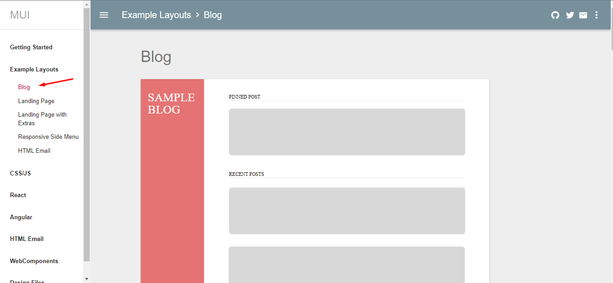
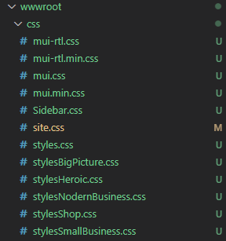
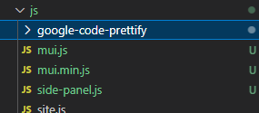

# 7Core-Mvc-Api-MUI-UI

Digite o comando:
```
dotnet new mvc 
```
TELA COM O MATERIAL DESIGN TEMA BLOG INSTALADO:

INSTALAÇÃO DO MUI-UI


Seguindo as instruções do fabricante, vamos modificar o arquivo /Shared/_Layout.cshtml com o seguinte código:
```
<!DOCTYPE html>
<html lang="en">
<head>
    <meta charset="utf-8" />
    <meta name="viewport" content="width=device-width, initial-scale=1.0" />
    <title>@ViewData["Title"] - _7CoreApiRestFullCSharpMvc</title>
    <link rel="stylesheet" href="~/lib/bootstrap/dist/css/bootstrap.min.css" />
    <link rel="stylesheet" href="~/css/site.css" asp-append-version="true" />
    <link rel="stylesheet" href="~/_7CoreApiRestFullCSharpMvc.styles.css" asp-append-version="true" />
    <link href="~/css/mui.css" rel="stylesheet" />
    <link href="~/css/Sidebar.css" rel="stylesheet" />
    <link href="~/css/Glyphicons.css" rel="stylesheet" />
    <link href="~/css/styles.css" rel="stylesheet" />
    <link href="~/js/prettify.css" rel="stylesheet" />
</head>
<body>
<div id="sidebar">
  <div class="mui--text-light mui--text-display1 mui--align-vertical">SAMPLE BLOG</div>
</div>
<div id="content" class="mui-container-fluid">
        @RenderBody()
</div>

    <script src="~/lib/jquery/dist/jquery.min.js"></script>
    <script src="~/lib/bootstrap/dist/js/bootstrap.bundle.min.js"></script>
    <script src="~/js/site.js" asp-append-version="true"></script>
    <script src="~/js/mui.min.js"></script>
    <script src="~/js/side-panel.js"></script>
    <script src="~/js/prettify.js"></script>
    <!-- Bootstrap core JS-->
    <script src="https://cdn.jsdelivr.net/npm/bootstrap@5.1.3/dist/js/bootstrap.bundle.min.js"></script>

    @await RenderSectionAsync("Scripts", required: false)
</body>
</html>
```



Mas sobre o 
[MUI - Google Material Design em:](https://www.muicss.com/)